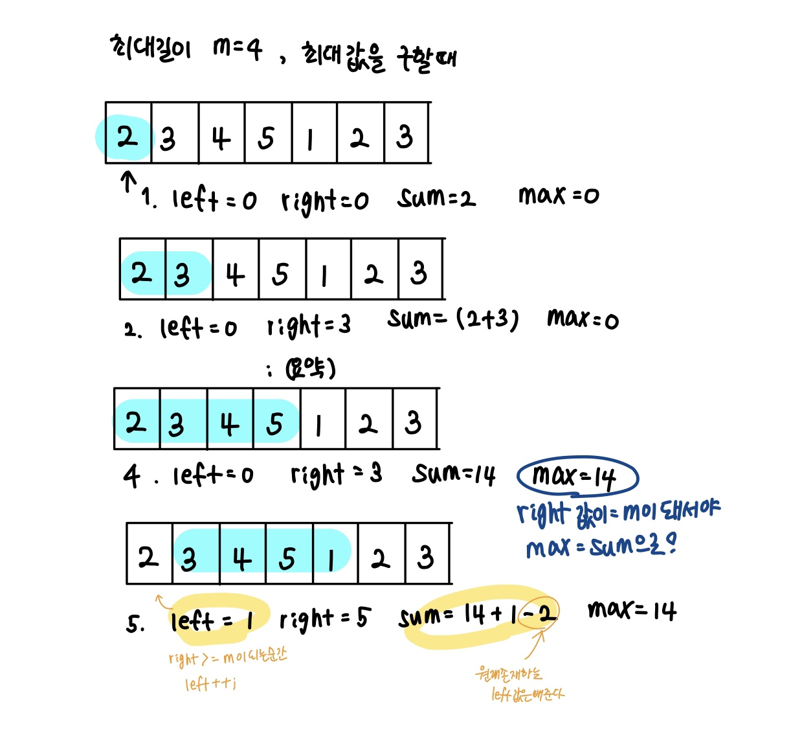

# 1주차 - 슬라이딩 윈도우, 투포인트 정리

## 슬라이딩 윈도우 (sliding-window)

* 원래 있던 값을 참고해서 검사한다.

### 예제 문제 1 - pro2
> 입력 : 매개변수 nums에 N(5<=N<=100,000)일 동안의 매출 기록이 주어진다. 
매개변수 k에 K(2<=K<=N) 이 주어진다. 
입력 예제 : [20,12,20,10,23,17,10], 4

* 접근 방법 
슬라이딩 윈도우를 이용하여 매출 구간을 정한다. 
hash map에넣고hash map size를 통해 중복을 체크한다. 
(만약, left가 이동하면 hash에서 set을 다시한다. 그리고 다시 hash map size 체크한다. 
삭제하면서 key 값의 value가 0이라면 delete까지 해주어야 size에 삭제한게 반영이 되지 않는다.

> array.push 로 배열에 넣어서 출력 가능 

